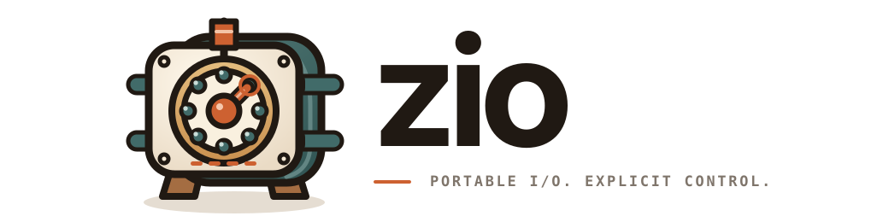

<p align="center">
  
</p>

<p align="center">
  <strong>Bounded, explicit readiness I/O for Rust.</strong>
</p>

zio is a small synchronous poller built directly on epoll and kqueue. It is not
an async runtime.

## Support

| Platform | Backend | Status |
| --- | --- | --- |
| Linux | epoll + eventfd | Native-qualified |
| 64-bit macOS | kqueue + `EVFILT_USER` | Native-qualified |
| 64-bit FreeBSD, NetBSD | kqueue + `EVFILT_USER` | Native CI, experimental |

Requires Rust 1.88 or newer.

## Use

```rust
use std::net::TcpListener;
use zio::{Interest, Key, Mode, Poll, Wait};

fn main() -> Result<(), Box<dyn std::error::Error>> {
    let listener = TcpListener::bind("127.0.0.1:0")?;
    listener.set_nonblocking(true)?;

    let mut poll = Poll::new()?;
    let registration =
        poll.register(&listener, Key::new(7), Interest::READABLE, Mode::Level)?;

    let mut events = poll.events()?;
    let report = poll.wait(&mut events, Wait::NoBlock)?;
    for event in events.iter() {
        println!("{event:?}");
    }
    report.into_result()?;
    poll.delete(registration)?;
    Ok(())
}
```

Callers choose registration and event limits, interests, delivery modes, keys,
and wait behavior. Successful waits reuse fixed zio-owned storage.

## Contracts

- Pollers duplicate descriptors by default.
- Owned transfer returns rejected descriptors; unsafe borrowing skips duplication.
- Level delivery repeats; one-shot delivery requires explicit rearming.
- Readiness is advisory. Nonblocking I/O remains the source of truth.
- Wake signals are bounded, coalesced, drainable, and observable.
- Mutation and recovery failures report whether backend state changed.

See [Contracts](docs/contracts.md) for the precise guarantees.

## Crates

| Crate | Purpose |
| --- | --- |
| [`zio`](https://docs.rs/zio) | Readiness polling, ownership, and native backends |
| [`zio-testkit`](https://github.com/zsumz/zio/blob/main/crates/zio-testkit/README.md) | Workspace-private mutation, wake, and readiness conformance |

## Verify

```sh
zcheck run check
zrail diff --base HEAD --deny-grants
```

See [Qualification](docs/qualification.md) for the evidence model and
[Performance](docs/performance.md) for reproducible peer measurements.

## Scope

zio does not provide edge triggering, Windows support, timers, signals,
process watching, socket construction, an executor, or an async runtime. Unsafe
code is confined to reviewed syscall and borrowed-descriptor leaves.

zio is a [published pre-alpha](https://crates.io/crates/zio) and is not release-ready.

## License

Apache-2.0. See [LICENSE](LICENSE).
